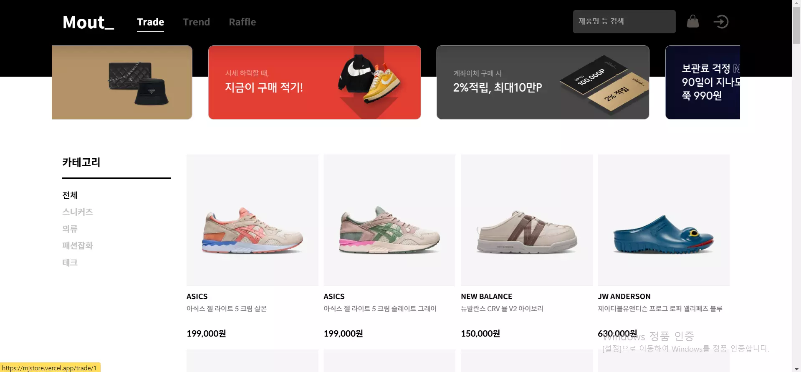
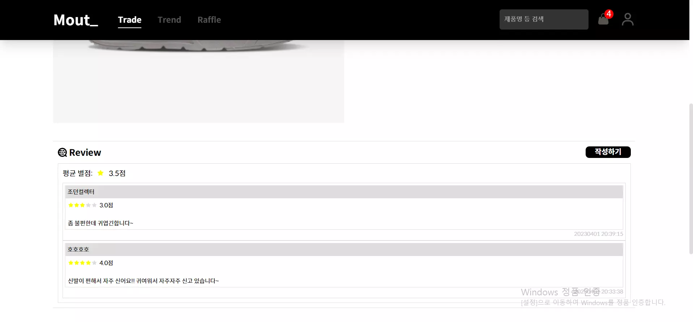
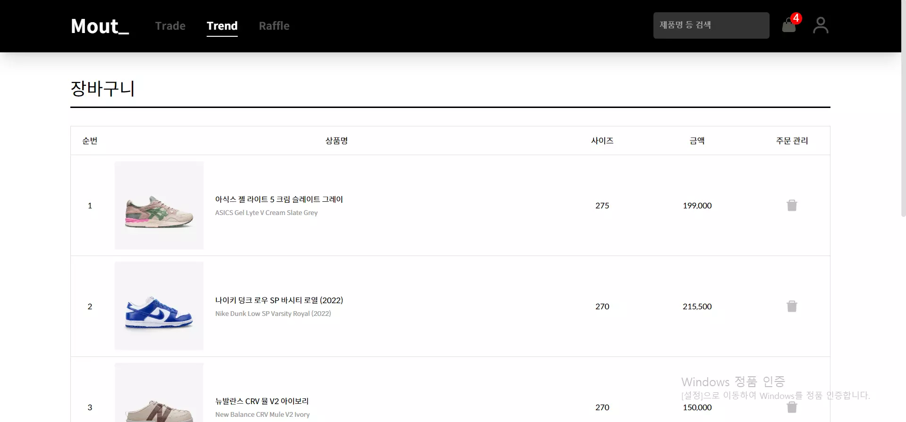
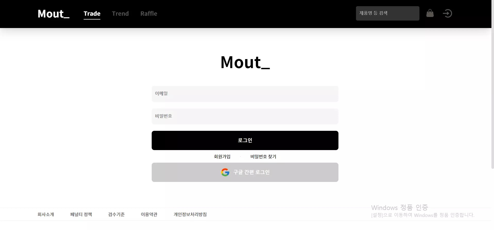
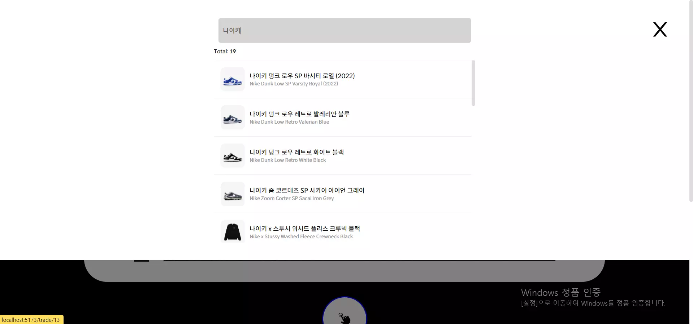
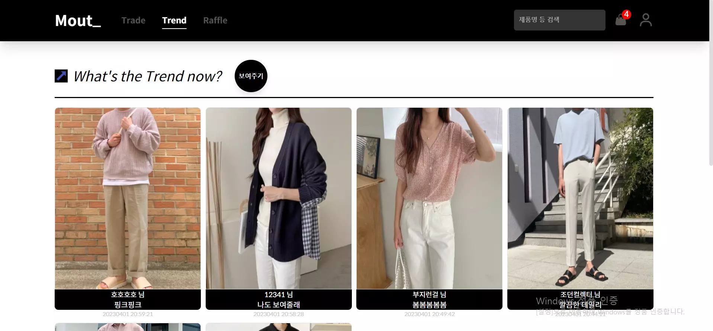

# Mout\_\_

---

### 🥼 쇼핑몰 및 스타일 공유 커뮤니티 웹 서비스

- React를 공부하고 프론트엔드 개발자로서 구현해야 하는 기본적인 요소들이 들어가 있는 쇼핑몰을 구현했습니다. 쇼핑몰 중 옷에 관심이 많아 의류 쇼핑몰에, 스타일 공유 커뮤니티를 추가해 옷에 관심이 많은 사람들끼리 각자의 스타일을 공유할 수 있는 서비스입니다.
- #### [배포 링크](https://mjstore.vercel.app/)

### 💿 주요 기술

- React
- TypeScript
- Emotion : 컴포넌트 별 스타일 관리
- React-Query : 상태 관리 라이브러리
- Axios : 비동기 통신을 위해 사용
- Firebase Auth / Firestore Database : 유저 / 게시물 / 별점 / 댓글 등의 데이터베이스

### 💿 API

- 마음에 드는 API를 찾지 못해 JSON 데이터를 만들고 Glitch로 배포하여 사용

### 💿 주요 기능

- 카테고리 별 제품 분류 / 제품 별 상세 페이지

- 제품 상세 페이지 내 후기/별점 작성 : 모든 후기들의 별점을 통해 제품 평균 별점 확인

- 장바구니
  - 상세페이지 사이즈 선택 후 장바구니 추가
  - 장바구니 담겨 있는 개수는 아이콘을 통해 확인
  - 장바구니 제품들을 확인 후 결제 직전 페이지까지 이동 가능

- 로그인 / 회원가입
  - 이메일 또는 구글 계정으로 회원가입 시 유저 데이터베이스에 회원 정보 저장
  - 필수 동의 문항 유효성 검사를 통한 회원가입 진행

- 검색창 자동완성
  - 검색어 입력 시 디바운스 훅을 통한 성능 최적화
  - 키워드가 포함되어 있는 제품 리스트 나열

- 회원 스타일 공유 커뮤니티
  - 회원 정보가 있을 시 이미지와 텍스트 입력을 통해 게시물 작성
  - 여러 회원들의 스타일 공유 게시물 확인

