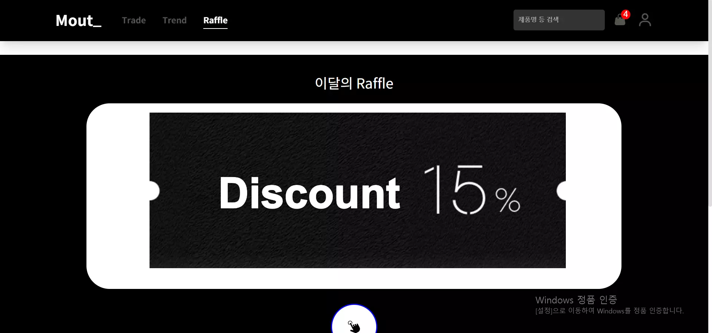

# Mout\_\_

---

1. 개요

이전 React 프레임워크 활용 과제 제출 후에 부족했던 부분과 구현하지 못했던 부분들을 더 공부하여 프로젝트를 진행하였다.
내가 자주 이용하는 쇼핑몰인 무신사스토어, 솔드아웃과 비슷한 컨셉으로 쇼핑몰을 만들었고,
로그인/회원가입부터 시작해 기본적인 쇼핑몰 기능에 추가적으로 유저의 스타일을 공유하는 커뮤니티 페이지, 상품 랜덤 추첨 페이지를 추가하였다.

2. 기능

- 카테고리별 상품 분류
  

- 별점 및 리뷰 작성
  

- 장바구니
  

- 로그인 페이지 : 기본 이메일 주소로 가입하거나 구글 로그인 가능
  

- 검색창 자동완성
  

- 회원 스타일 공유 커뮤니티
  

- 상품 랜덤 추첨
  

3. 기술 스택 : Typescript, React, Emotion, Firebase Auth, Firestore Database
